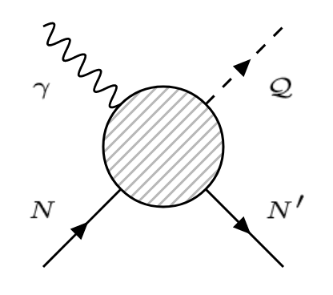
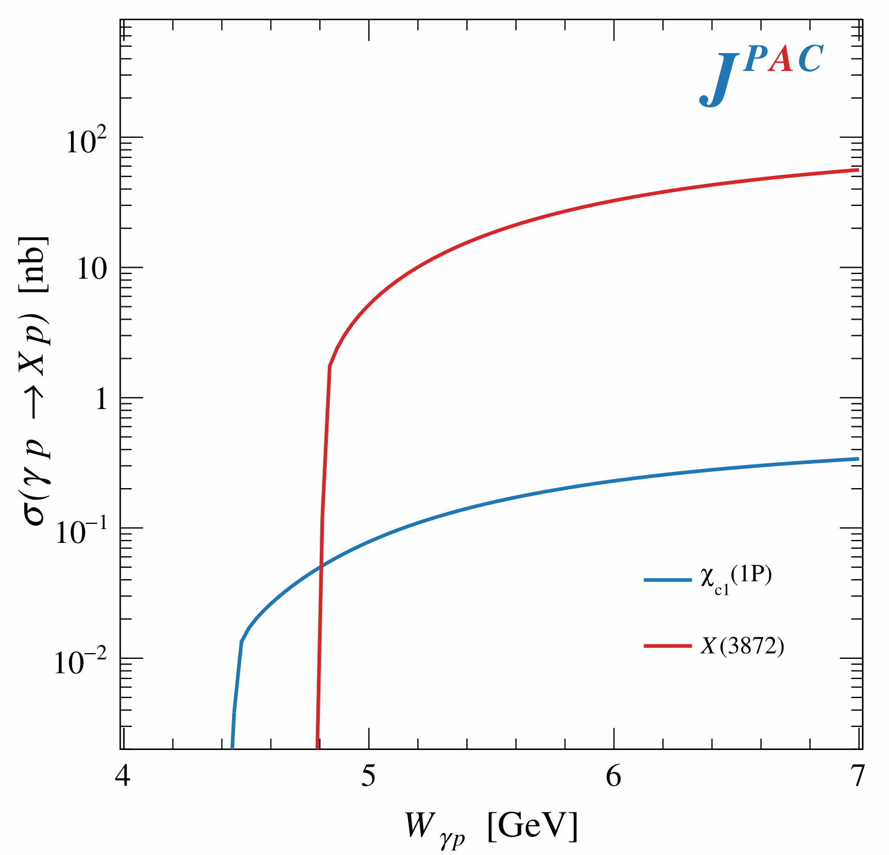
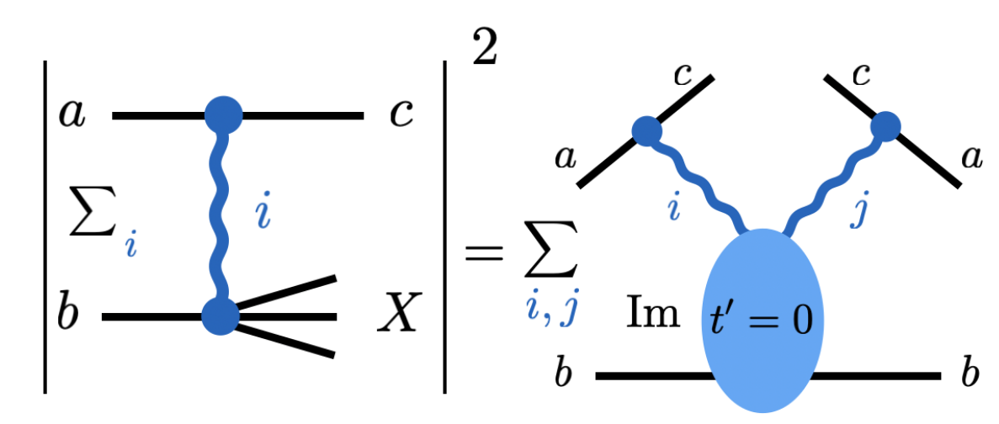
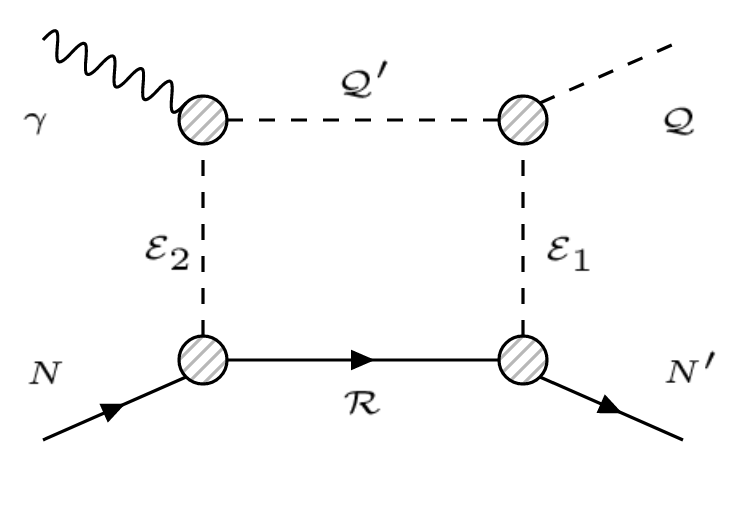

#   jpacPhoto
Framework for amplitude analysis involving single meson production via quasi-elastic scattering of a real photon on a nucleon target. Focus on expandability and easy interfacing with Monte-Carlo tools and event generators.

<p align="center">
  
</p>


Base library requires only [ROOT](https://root.cern.ch/) (tested with version 6.17 and 6.24) with [*MathMore*](https://root.cern.ch/mathmore-library) libraries installed. 

Optional dependencies include [Boost C++](https://www.boost.org/) libraries for the extension jpacBox library to compute one-loop box diagrams and the [jpacStyle](https://github.com/dwinney/jpacStyle) library to build executables which reproduce plots in e.g. to reproduce plots in [[1]](https://arxiv.org/abs/1907.09393) and [[2]](https://arxiv.org/abs/2008.01001).

##  INSTALLATION
To install clone normally and use:
```bash
mkdir build && cd build
cmake ..
cmake --build . --target install
```
This will create the core library `/lib/libjpacPhoto.so` with the linkable library. Modules `libjpacInclusive.so` and `libjpacBoxlib.so` will also be built as additional libraries, the latter only if Boost C++ is found in $PATH. Root dictionaries and .pcm files for all libraries are also installed in `lib` directory.

If the [jpacStyle](https://github.com/dwinney/jpacStyle) library is installed, the exectuable `/bin/plotPhoto` is compiled which allows scripts in the `/examples` to be run with ROOT's cling interpeter. 

The executable as well as parts of `jpacInclusive` require the environment variable JPACPHOTO to be set to the top-level directory in order to find auxilary files. This can be done as such:
```bash
export JPACPHOTO=/path/to/jpacPhoto # for bash
setenv JPACPHOTO /path/to/jpacPhoto # for csh
```

##  Usage
The linkable libraries can be added to an existing CMake project using `find_library()` and linked as normal:
```cmake
find_library(PHOTOLIB NAMES jpacPhoto libjpacPhoto
                       HINTS "$ENV{JPACPHOTO}/lib")
target_link_libraries( myTarget jpacPhoto)
```

Generating plots to reproduce results in JPAC papers, the bin folder can be added to $PATH after installation such that `photoPlot` can be called from any directory. 
For example:
```bash
export PATH=$PATH:$JPACPHOTO/bin

cd examples/core/exlusive_XYZ
photoPlot X3872_low.cpp
```
will generate Fig. 3a of [[2]](https://arxiv.org/abs/2008.01001).
<p align="center">
  
</p>
 If you do not want to modify your $PATH, simply add the relative path to the `photoPlot` executable.

##  AMPLITUDES
The main object of interest in the core library is the abstract [`amplitude`](./include/amplitudes/amplitude.hpp) class. Given phtoproduction reactions are calculated on a per-helicity-amplitude basis  which allows one to compute an array of [observables](./src/amplitudes/observables.cpp):
* Probability distribution ( Σ_λ | A |^2 )
* Differential cross section ( dσ / dt )
* Integrated total cross section ( σ )
* Polarization asymmetries ( A_LL and K_LL )
* Spin density matrix elements ( ρ^α_λ,λ' )
* Integrated beam asymmetry ( Σ_4pi )
* Beam asymmetry in the y-direction ( Σ_y )
* Parity asymmetry ( P_σ )

All kinematics are passed around by the `reaction_kinematics` class which allows all masses to float and accepts arbitrary quantum numbers for the final state meson and baryon (although not all amplitudes below may be available for a given final state).

The basic usage is:
```c++
// Set up kinematics
reaction_kinematics myKin (M_MESON, M_BARYON) 
myKin.set_meson_JP(1, -1);  // J = 1  , P = -1
myKin.set_baryon_JP(1, 1); // J = 1/2, P =  1

// Set up amplitude
my_amplitude myAmp(&myKin, /* additional parameters */);
myAmp.set_params{ {/* couplings */} };

// Evaluate observables
myAmp.integrated_xsection(s);
myAmp.SDME(alpha, lam1, lam2, s, t);
```

Available amplitudes, so far, include:

### s-channel:
* [Baryon resonance](./include/amplitudes/baryon_resonance.hpp) - following [[1]](https://arxiv.org/abs/1907.09393), Breit-Wigner resonance for a baryon of spin up to 5/2 and arbitrary parity. 
 
### t-channel:
* [Pomeron exchange](./include/amplitudes/pomeron_exchange.hpp) - three parameterizations of Pomeron exchange are available: [helicity-conserving](https://arxiv.org/abs/1606.08912), [exponential-pomeron](https://arxiv.org/abs/1907.09393), and [dipole-pomeron](https://arxiv.org/abs/1508.00339).
* [(fixed-spin and reggeized) Pseudo-scalar meson exchange](./include/amplitudes/pseudoscalar_exchange.hpp) - allows production of mesons with pseudo-scalar, vector, and axial-vector mesons and spin-1/2+ and 3/2+ baryons.
* [(fixed-spin and reggeized) Vector meson exchange](./include/amplitudes/vector_exchange.hpp) - allows production of mesons with scalar, pseudo-scalar, vector, and axial-vector quantum numbers
* [Primakoff effect off nuclear target](./include/amplitudes/primakoff_effect.hpp) - special amplitude for investigation of X(3872) production via Primakoff effect

### u-channel:
* [(fixed-spin) Dirac fermion exchange](./include/amplitudes/dirac_exchange.hpp) - allows production of mesons with pseudo-scalar and vector quantum numbers and spin-1/2+, 1/2- and 3/2- baryons.

Incoherent (interfering) sums of amplitudes may be constructed through the [`amplitude_sum`](./include/amplitudes/amplitude_sum.hpp) class.

## SEMI-INCLUSIVE REACTIONS
The optional library `jpacInclusive` extends the results of the excluive amplitudes above to consider semi-inclusive production in the Mueller-Regge formalism. 

<p align="center">
  
</p>

Unlike individual amplitudes above, semi-inclusive production is calcultated at the cross-sections level but may be calculated as a function of total center-of-mass energy, momentum transfer, and invariant missing mass. 

Basic structure looks like:
```c++
// Exclusive amplitude set up as above with couplings / kinematics already set
amplitude myExcAmp;

// Pass exclusive amplitude to triple_regge object
triple_regge myIncAmp (&myExcAmp);

// Output observables
myIncAmp.invariant_xsection(s, t, M2);
myIncAmp.integrated_xsection(s);
```
This extention is currently only available for pion-exchange processes but will be expanded to include other exchanges.

##  BOX AMPLITUDE
The optional library `jpacBox` allows exchange amplitudes (in the t and u-channels) to be combined into a [box diagram](./include/box/box_amplitude.hpp) of the form:

<p align="center">
  
</p>

The calculation is done via a dispersion relation and integrating over the entire intermediate phase-space. The `box_amplitude` class requires the `gauss_kronrod` integration method from Boost C++ which can natively handle complex integrands and thus makes it particularly efficient in computing dispersion relations. 

```c++
// Set up left and right amplitudes by cutting box along the middle
// Left amplitude involves a photon 
reaction_kinematics kLeft (0., M_N, M_QPRIME, M_R);
amplitude leftAmp (&kLeft, /* other parameters */);

// Right amplitude involes a massive "beam" 
reaction_kinematics kRight(M_Q, M_NPRIME, M_QPRIME, M_R);
amplitude rightAmp (&kRight, /* other parameters */);

// Create kinematics object for the whole reaction
reaction_kinematics kBox (0, M_N, M_Q, M_NPRIME);

// Finally create a box amplitude object
box_amplitude myBox (&kBox, &leftAmp, &rightAmp);

// box_amplitude inherits from jpacPhoto::amplitude and can be treated as such
```

##  REFERENCES
+ [1] [Double Polarization Observables in Pentaquark Photoproduction](https://arxiv.org/abs/1907.09393)
+ [2] [XYZ spectroscopy at electron-hadron facilities: Exclusive processes](https://arxiv.org/abs/2008.01001)
+ [3] [JPAC Website](http://cgl.soic.indiana.edu/jpac/index.php)

<p align="center">
  
</p>