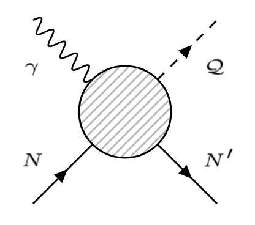

#   jpacPhoto
Framework for amplitude analysis involving one or two meson photoproduction off nucleon targets. Focus on expandability and easy interfacing with other libraries / analysis code. 

<p align="center">
  
</p>


Compilation of the base library requires only [ROOT](https://root.cern.ch/) (tested with version 6.17 and 6.24) with [*MathMore*](https://root.cern.ch/mathmore-library) and [Boost C++](https://www.boost.org/) (version $\geq$ 1.68) libraries.

##  INSTALLATION
To install clone normally and use:
```bash
cd jpacPhoto
mkdir build && cd build
cmake ..
cmake --build . --target install
```
This will create the core library `/lib/libJPACPHOTO.so` with the linkable library as well as ROOT dictionary (.pcm) files. 

Additionally a [scripting executable](./src/cling/jpacPhoto.cpp) will be installed into `/bin/jpacPhoto` which short-cuts loading the libraries into an interactive ROOT session and running a .cpp file as an interpreted script.   
This executable requires the environment variable `JPACPHOTO` to be set to the top-level directory in order to find auxilary files. This can be done as such:
```bash
export JPACPHOTO=/path/to/jpacPhoto # for bash
setenv JPACPHOTO /path/to/jpacPhoto # for csh
```

##  USAGE

The primary use case is to reproduce results from JPAC papers [[1-4]](#references). The compiled library contains the framework of amplitudes and observables as abstract classes with specific amplitude models imported at run-time as a header-only library. The compiled jpacPhoto executable pipes an analysis script, relevent amplitude files, and compiled library into the cling interpeter to run. 

This set up mimics a Python-like environment without requiring recompilation when changes are made to amplitude files. Amplitudes and scripts relevant for JPAC papers are located in [`/physics/`](./physics/) and [`/scripts/`](./scripts) respectively.  To run a script located in the bin directory simply run 
```bash
jpacPhoto my_script.cpp
```
or add the bin directory to $PATH to call `jpacPhoto` from any directory. 

The linkable library can be added to an existing CMake project using `find_library()` and linked as normal:
```cmake
find_library(JPACPHOTO NAMES JPACPHOTO libJPACPHOTO
                       HINTS "$ENV{JPACPHOTO}/lib")
target_link_libraries( myTarget JPACPHOTO)
```

##  SINGLE MESON AMPLITUDES
The main object of interest in the core library is the abstract [`one_meson::amplitude`](./src/core/amplitude.hpp) and implementations defined by the user which defines the scattering amplitude for a 2-to-2 process. Amplitudes implemented so may be found in [/physics/](./physics/) as well as a [template file](./amplitudes/template.hpp) with which to add new classes. Models are implemented and calculated on a per-helicity-amplitude basis which allows one to compute an array of observables:

| Observable                           |                                                 | Callable `amplitude` function                                                                                                  |
|--------------------------------------|-------------------------------------------------|--------------------------------------------------------------------------------------------------------------------|
| Unpolarized probability distribution | $\sum_{\{\lambda\}} \|A_{\{\lambda\}}\|^2$ | `probability_distribution(double s, double t)       `                                                                |
| Differential cross section \[nb/GeV $^2$\]          | $d\sigma/dt$                           | `differential_xsection(double s, double t)            `                                                              |
| Integrated total cross section \[nb\]     | $\sigma$                                 | `integrated_xsection(double s)      `                                                                                |
| Double polarization asymmetries      | $A_{LL},K_{LL}$                                 | `A_LL(double s, double t)` <br /> `K_LL(double s, double t)    `                                                              |
| Meson spin density matrix elements   | $\rho^{a}_{\lambda,\lambda^\prime}$        | `SDME_H(int a, int lam, int lamp, double s, double t)` <br /> `SDME_GJ(int a, int lam, int lamp, double s, double t)` |
| Beam asymmetries            | $\Sigma_{4\pi}, \Sigma_y$                                 | `beam_asymmetry_4pi(double s, double t)` <br />  `beam_asymmetry_y(double s, double t)  `                                                                       |
| Parity asymmetry                     | $P_\sigma$                                      | `parity_asymmetry(double s, double t)            `                                                                   |


All kinematics are passed around by the [`kinematics`](./src/core/kinematics.hpp) class which allows arbitrary masses for all particles and arbitrary quantum numbers for the produced final state meson & baryon.

The basic usage is:
```c++
using namespace jpacPhoto::one_meson;

// Set up kinematics
kinematics myKin = new_kinematics(M_MESON, M_BARYON);
myKin->set_meson_JP(1, -1);  // J = 1  , P = -1
myKin->set_baryon_JP(1, 1);  // J = 1/2, P =  1

// Set up amplitude
amplitude myAmp1 = new_amplitude<my_implementation>(myKin, /* additional parameters */);
myAmp1->set_parameters{ {/* couplings etc */} };

amplitude myAmp2 = new_amplitude<my_other_implementation>(myKin, /* additional parameters */);
myAmp2->set_parameters{ {/* couplings etc */} };

// Evaluate observables
myAmp1->integrated_xsection(s);
myAmp2->SDME(0, 1, -1, s, t);
```
Multiple amplitudes may describe the same process sharing the same kinematics instance and
incoherent (interfering) sums any combination of (compatible) amplitudes may be constructed. Partial wave projections onto Legendre and Wigner functions can be taken for any amplitude of combination of amplitudes. All of these are treated as amplitudes themselves and have access to observables are available with the same syntax:
```c++
using namespace jpacPhoto::one_meson;

// Sum two amplitudes together
amplitude amp1, amp2;
amplitude sum = amp1 + amp2;
sum->set_parameters{ /* couplings for both amp1 and amp2 */};

// Take the J = 1 partial wave
amplitude pwave = project(1, sum);

// Access observables
amp1->integrated_xsection(s);  // Individual term
sum->integrated_xsection(s);   // Interfering sum
pwave->integrated_xsection(s); // Only P-wave contribution of sum
```
##  TWO MESON AMPLITUDES
A second amplitude class, [`two_meson::amplitude`](./src/core/amplitude2.hpp) extends the above framework to 2-to-3 processes. At present this only allows for the two mesons to be pseudoscalars with helicity amplitudes only depending on the beam, target, and recoil particle helicities. The usage is identical to the 2-to-2 case within a different namespace:
```c++
using namespace jpacPhoto::two_meson;

// Set up kinematics
kinematics myKin = new_kinematics(M_MESON1, M_MESON2, M_BARYON);
myKin->set_meson_labels( "eta", "pi"); // Optional string id's to differentiate mesons

// Set up amplitude
amplitude myAmp1 = new_amplitude<my_implementation>(myKin, /* additional parameters */);
myAmp1->set_parameters{ {/* couplings etc */} };

amplitude myAmp2 = new_amplitude<my_other_implementation>(myKin, /* additional parameters */);
myAmp2->set_parameters{ {/* couplings etc */} };

// Evaluate observables. 
// Dependent variables are always three invariants and Gottfried-Jackson angles
myAmp1->differential_xsection(s, t, setapi, thetaGJ, phiGJ);
(myAmp1 + myAmp2)->differential_xsection(s, t, setapi, thetaGJ, phiGJ);
```
##  JPAC(PHOTO, AMP)TOOLS
An optional extention to the core library which provides a generic interface for using JPAC amplitudes with analysis utilities of [AmpTools](https://github.com/mashephe/AmpTools/tree/master/AmpTools) can be built by passing the `-DJPACTOOLS=TRUE` flag when configuring CMake. This requires that the `AmpTools` is installed following the installation instructions but compiled with the additional `-fPIC` CXX flag and the `$AMPTOOLS` environment variable set to the top-level directory containing the installation.

Here the class template [`jpacAmplitude<A>`](./src/AmpTools/jpacAmplitude.hpp) wraps `jpacPhoto::amplitude` to be used in event generators or fits through:
```c++
AmpToolsInterface::registerAmplitude( jpacAmplitude<my_implementation>() );
```
where `my_implementation` is a user implemented struct containing static functions which inject the amplitude details into the AmpTools interfaces. Examples and templates of this are found in [/AmpTools/](./AmpTools/).

##  REFERENCES
+ [1] [Double Polarization Observables in Pentaquark Photoproduction](https://arxiv.org/abs/1907.09393)
+ [2] [XYZ spectroscopy at electron-hadron facilities: Exclusive processes](https://arxiv.org/abs/2008.01001)
+ [3] [XYZ spectroscopy at electron-hadron facilities II: Semi-inclusive processes with pion exchange](https://arxiv.org/abs/2209.05882)
+ [4] [Dynamics in near-threshold J/ψ photoproduction](https://arxiv.org/abs/2305.01449)
+ [5] [JPAC Website](http://cgl.soic.indiana.edu/jpac/index.php)

<p align="center">
  
</p>